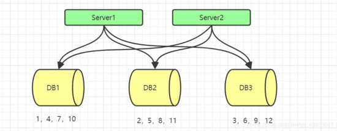
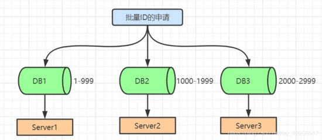
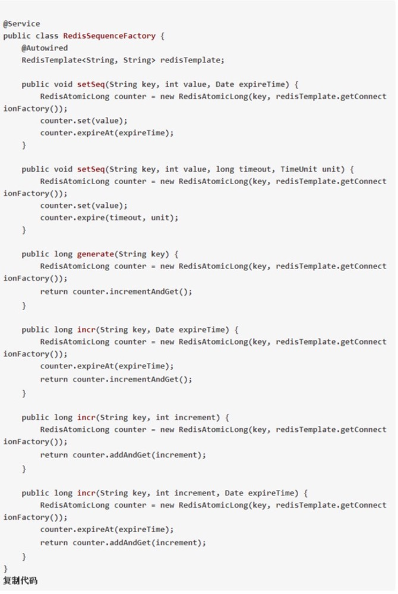
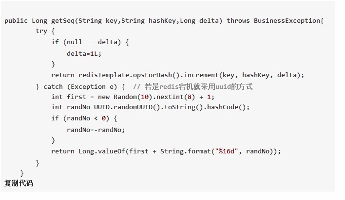

{{ page.title }}
================

生成分布式Id的方法？
-----------------

主要有以下几种：

1. 数据库自增ID。

2. 数据库水平拆分，设置初始值和相同的自增步长。

3. 批量申请自增ID。

4. UUID生成。

5. Redis的方式。

6. 雪花算法。

7. 百度UidGenerator算法

8. 美团Leaf算法


数据库自增ID
-----------------

在创建表的时候，指定主键 auto_increment （自增）便可以实现。但是使用数据库的自增ID，虽然简单，会带来ID重复的问题，并且单机版的ID自增，并且每次生成一个ID都会访问数据库一次，DB的压力也很大，并没有什么并发性能可言。

> 数据库水平拆分，设置初始值和相同的自增步长

「 数据库水平拆分，设置初始值和相同的自增步长 」和 「 批量申请自增ID 」。指在DB集群的环境下，将数据库进行水平划分，然后每个数据库设置 「 不同的初始值 」和 「 相同的步长 」，这样就能避免ID重复的情况。如下图：



假设有三个数据库，为每一个数据库设置初始值，设置初始值可以通过下面的sql进行设置：
```sql
set @@auto_increment_offset = 1;     // 设置初始值set 
set @@auto_increment_increment = 2;      // 设置步长复制代码
```
三个数据的初始值分别设置为1、2、3，一般步长设置为数据库的数据，这里数据库数量为3，所以步长也设置为3。
> 扩容存在问题

但扩容的情况是这种方法的一个缺点，上面我说的步长一般设置为数据库的数量，这是在确保后期不会扩容的情况下，若是确定后期会有扩容情况，在前期设计的的时候可以将步长设置长一点， 「 预留一些初始值给后续扩容使用 」。

> 优缺点

缺点： 「 后期可能会面对无ID初始值可分的窘境，数据库总归是数据库，抗高并发也是有限的 」 。<br/>
优点： 「 DB单点的问题 」。

批量申请自增ID
-----------------

一次性给对应的数据库上分配一批的id值进行消费，使用完了，再回来申请。



在设计的初始阶段可以设计一个有初始值字段，并有步长字段的表，当每次要申请批量ID的时候，就可以去该表中申请，每次申请后 「 初始值=上一次的初始值+步长 」。

这样就能保持初始值是每一个申请的ID的最大值，避免了ID的重复，并且每次都会有ID使用，一次就会生成一批的id来使用，这样访问数据库的次数大大减少。

但是这一种方案依旧有自己的缺点，依然不能抗真正意义上的高并发。

UUID生成
-----------------

UUID的核心思想是使用 「 机器的网卡、当地时间、一个随机数」来生成UUID。

> 优缺点

优点：调用 UUID.randomUUID().toString() 就可以生成，这种方式方便简单，本地生成，不会消耗网络。<br/>
缺点：
1. UUID虽然能够保证ID的唯一性，但是无法满足业务系统需要的很多其他特性，例如：时间粗略有序性、可反解和可制造性；
2. UUID产生时使用完全的时间数据，性能比较差；
3. UUID比较长，会占用空间大，间接导致数据库性能下降；
4. UUID并不具有有序性，会导致B+树索引在写的时候有过多的随机写操作(连续的ID会产生部分顺序写);
5. 在写的时候不能产生有序的append操作，而需要进行insert操作，将读取整个B+树节点到内存，在插入这条记录后会将整个节点写回磁盘，这种操作在记录占用空间比较大的情况下，性能会明显下降。
6. UUID目前不是顺序增长，做为主键写入导致，随机IO严重。

Redis的方式
-----------------
Redis本身有 incr 和 increby 这样自增的命令，保证原子性，生成的ID也是有序的。

> 优缺点

优点：Redis基于内存操作，性能高效，不依赖于数据库，数据天然有序，利于分页和排序。

缺点：因为增加了中间件，需要自己编码实现工作量增大，增加复杂度。

> 持久化问题

使用Redis的方式还要考虑持久化，Redis的持久化有两种 「 RDB和AOF 」， 「 RDB是以快照的形式进行持久化，会丢失上一次快照至此时间的数据 」 。「 AOF可以设置一秒持久化一次，丢失的数据是秒内的」，也会存在可能上一次自增后的秒内的ID没有持久化的问题。

> Redis的生成分布式ID的工具类代码

1. 第一种是使用 RedisAtomicLong 原子类使用CAS操作来生成ID。



2. 第二种是使用 redisTemplate.opsForHash() 和结合 UUID 的方式来生成生成ID。






